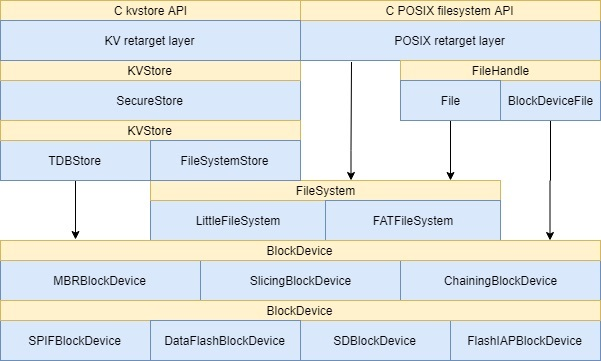
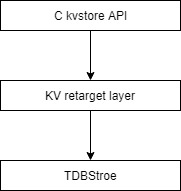
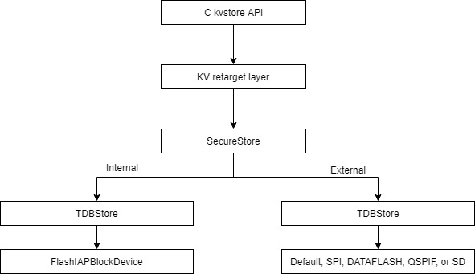
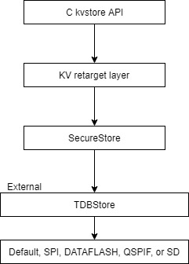
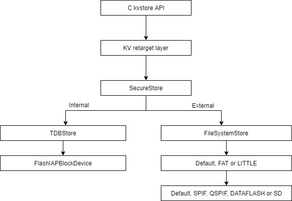
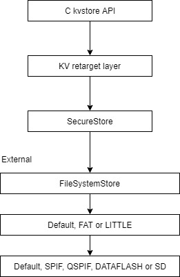

# Storage configuration 

This document describes the configurations of the mbed OS storage based on kv_store interface. 

## New storage design



This document describes the configuration for the KVStore part (left side of the diagram above) and its underlying components, such as file systems and block devices.

The configuration concept is based on a number of predefined topologies (configurations) allowing customers to select one of them or to define a topology.

The last section of this document explains how to override the configuration option in order to enable storage configuration that none of the configurations above support.  

To use the default configurations, set the `storage_type` parameter to one of the configurations options available.

The implementation of the configuration is composed of a set of `.json` files and a set of functions instantiating and initializating the required components.

## Configuration structure

```
kvstore
│
└───conf
    │   mbed_lib.json
    │
    ├───tdb_external
    │       mbed_lib.json
    │
    ├───tdb_external_no_rbp
    │       mbed_lib.json
    │
    ├───filesystem
    │       mbed_lib.json
    │
    ├───filesystem_no_rbp
    │       mbed_lib.json
    │
    └───tdb_internal
            mbed_lib.json
```

The KVStore configuration file structure includes six configuration files. The topmost configuration file is used to set up the full configuration of the storage by defining a single parameter (`storage_type`) to one of the predefined configurations. The configuration files in the subfolders are used to implement the above top level configurations.

You can find the configuration files `conf/<configuration name>`:

* `conf/tdb_internal` - storage type `TDB_INTERNAL` configuration is intended to be used when all data will be stored in internal memory only. No need for additional security features. A single TDBStore object will be allocated in internal flash.
* `conf/tdb_external` - storage type `TDB_EXTERNAL` configuration is providing full security and intended to be used when data is stored in external flash. It allocates: SecureStore, TDBStore in external flash and TDBStore in internal flash (for rollback protection - RBP).
* `conf/tdb_external_no_rbp` - storage type `TDB_EXTERNAL_NO_RBP` configuration allows security but without rollback protection. Similar to `tdb_external` but without the TDBStore in internal memory.
* `conf/filesystem` - This configuration will allocate: SecureStore, FileSystemStore, filesystem, TDBStore in internal memory and the required block devices. The allocated file system will be selected according to the COMPONENT set in `targets.json`, (FATFS for SD card and LittleFS for SPIF); however, you can set this differently by overriding the respective parameter. Use this configuration if you need the file system with a POSIX API in addition to the set/get API.
* `conf/filesystem_no_rbp` - storage type `FILESYSTEM_NO_RBP` configuration allows security like FILESYSTEM configuration but without rollback protection.

A standalone block device is allocated for each component in internal and external memory and SD cards as required for the configurations. The full size of the memory allocated for each block device is used by the respective component.

## Configuration parameters

The following is a list of all storage parameters available and their description. 

* `storage_type` - Used to select one of the predefined configurations.
    * `TDB_INTERNAL`.
    * `TDB_EXTERNAL`.
    * `TDB_EXTERNAL_NO_RBP`.
    * `FILESYSTEM`.
    * `FILESYSTEM_NO_RBP`.
* `default_kv` - This is a string representing the path for the default KVStore instantiation. Applications can pass an empty path (only the key name) or pass the generated name for this parameter (`MBED_CONF_STORAGE_DEFAULT_KV`) as the path to use this configuration.
* `internal_size` - The size in bytes for the internal FlashIAP block device. This, together with the `internal_base_address`, adjusts exactly the size and location where the block device resides on memory. If not defined, the block device will try to get the maximum size available.
* `internal_base_address` - The address where the internal FlashIAP blockDevice starts. This helps to prevent collisions with other needs, such as firmware updates. If not defined, the start address will be set to the first sector after the application code ends in `TDB_internal`. In any external configurations with rollback protection support, it will be set to end of flash - `rbp_internal_size`.
* `rbp_number_of_entries` - Sets the number of entries allowed for rollback protection. The default is set to 64. This parameter controls the maxmium number of different keys that can be created with rollback protection flag.
* `rbp_internal_size` - Sets the size for the rollback protection TDBStore in the internal memory. The base address is calculated as flash ends address - size.
* `filesystem` - Options are FAT, LITTLE or default. If not set or set to default, the file system type will be selected according to the storage component selected for the board in the `targets.json` file: FAT for "components": ["SD"] and Littlefs for "components": ["SPIF"].
* `blockdevice` - Options are default, SPIF, DATAFLASH, QSPIF or SD. If file system is set to default, this parameter is ignored.
* `external_size` - The size of the external block device in bytes. If not set, the maximum available size will be used. 
* `external_base_address` - The start address of the external block device. If not set, 0 address will be used.
* `mount_point` - Mount point for the file system. This parameter will be ignored if the file system is set to default.
* `folder_path` - Path for the working directory where the FileSystemStore stores the data.

## Storage configuration

Below is the main storage configuration `mbed_lib.json` file: 

```
{
"name": "storage",
    "config": {
        "storage_type": {
            "help": "Options are TDB_INTERNAL, TDB_EXTERNAL, TDB_EXTERNAL_NO_RBP, FILESYSTEM or FILESYSTEM_NO_RBP.",
            "value": "NULL"
        },
        "default_kv": {
            "help": "A string name for the default kvstore configurtaion",
            "value": "kv"
        }
    }
}
```
    
### `TDB_INTERNAL`

The internal configuration should be used for targets willing to save all the data in internal flash.



In this configuration, all KVStore C APIs are mapped to the TDBStore in the internal flash. To use this configuration, set the `storage_type` parameter in storage `mbed_lib.json` to `TDB_INTERNAL`. 

Below is the `TDB_INTERNAL` configuration `mbed_lib.json`:

```
{
    "name": "tdb_internal",
    "config": {
        "internal_size": {
            "help": "Size of the FlashIAP block device",
            "value": "NULL"
        },
        "internal_base_address": {
            "help": "If not defined the default is the first sector after the application code ends.",
            "value": "NULL"
        },
        "rbp_number_of_entries": {
            "help": "If not defined default is 64",
            "value": "64"
        }
    }
}
```

For this configuration, please define the section of the internal storage that will be used for data, by defining these parameters in your `app.config file`: `internal_base_address` and `internal_size`. If not defined, the storage will start in the first sector immediately after the end of the application. This can reduce the ability to update the application with a bigger one.

### `TDB_External`



`TDB_EXTERNAL` uses a TDBStore in the internal flash for security rollback protection and a TDBStore on the external flash for the data. In this configuration, all KVStore C API calls are mapped to work with the SecureStore class. This class handles the use of the two TDBStores. Tthe external TDBStore works on top of the default block device, and the internal TDBStore works with the FlashIAPBlockdevice. 

You can set the external TDBStore block device to any of the following block devices: SPIF, QSPIF, DATAFASH and SD.

You can enable this configuration by setting `storage_type` in storage `mbed_lib.json` to `TDB_EXTERNAL`.

Below is the `TDB_EXTERNAL` configuration `mbed_lib.json`:

```
{

    "name": "tdb_external",
    "config": {
        "rbp_internal_size": {
            "help": "If not defined default size is 4K*#enteries/32",
            "value": "NULL"
        },
        "rbp_number_of_entries": {
            "help": "If not defined default is 64",
            "value": "64"
        },
        "internal_base_address": {
            "help": "If not defined the default is the first sector after the application code ends.",
            "value": "NULL"
        },
        "blockdevice": {
            "help": "Options are default, SPIF, DATAFASH, QSPIF or SD",
            "value": "NULL"
        },
        "external_size": {
            "help": "Size of the external block device",
            "value": "NULL"
        },
        "external_base_address": {
            "help": "If not defined the default is from address 0",
            "value": "NULL"
        }
    }
}
```

### TDB_External_no_RBP



`TDB_EXTERNAL_NO_RBF` configuration has no support for rollback protection and is therefore less secure.

The `TDB_EXTERNAL_NO_RBP` uses only one TDBStore on the external flash for all data. In this configuration, all KVStore C API calls are mapped to work with the SecureStore class. The external TDBStore works on top of the default block device; however, you can set the external TDBStore block device to any of the following block devices: SPIF, QSPIF, DATAFASH and SD.

You can enable this configuration by setting `storage_type` in storage `mbed_lib.json` to `TDB_EXTERNAL_NO_RBP`.

Below is the `TDB_EXTERNAL_NO_RBP` configuration `mbed_lib.json`:

```
{
    "name": "tdb_external_no_rbp",
    "config": {
        "external_size": {
            "help": "Size of the external block device",
            "value": "NULL"
        },
        "external_base_address": {
            "help": "If not defined the default is from address 0",
            "value": "NULL"
        },
        "blockdevice": {
            "help": "Options are default, SPIF, DATAFASH, QSPIF or FILESYSTEM",
            "value": "NULL"
        }
    }
}
```

### FILESYSTEM



The FILESYSTEM configuration resembles the EXTERNAL but uses FileSystemStore on the external flash. By default, FileSystemStore uses the default file system and the default block device.

In this configuration, all KVStore C API paths are mapped to the SecureStore class. This class handles the use of the internal TDBStore or external FileSystemStore. 

You can enable this configuration by setting `storage_type` in storage `mbed_lib.json` to FILESYSTEM. 

Below is the FILESYSTEM configuration `mbed_lib.json`:

```
{
    "name": "filesystem_store",
    "config": {
        "rbp_internal_size": {
            "help": "If not defined default size is 4K*#enteries/32",
            "value": "NULL"
        },
        "rbp_number_of_entries": {
            "help": "If not defined default is 64",
            "value": "64"
        },
        "internal_base_address": {
            "help": "If not defined the default is the first sector after the application code ends.",
            "value": "NULL"
        },
        "filesystem": {
            "help": "Options are default, FAT or LITTLE. If not specified default filesystem will be used",
            "value": "NULL"
        },
        "blockdevice": {
            "help": "Options are default, SPIF, DATAFASH, QSPIF or FILESYSTEM. If not set the default block device will be used",
            "value": "NULL"
        },
        "external_size": {
            "help": "Size in bytes of the external block device, if not specified the maximum is the default.",
            "value": "NULL"
        },
        "external_base_address": {
            "help": "If not defined the default is from address 0",
            "value": "NULL"
        },    
        "mount_point": {
            "help": "Where to mount the filesystem. Ignored if the default file system is applied.",
            "value": "/sd"
        },
        "folder_path": {
            "help": "Path for the working directory where the FileSyetemStore stores the data",
            "value": "/kvstore"
        }
    }
}
```

If file system is not set, the default file system and block device are applied and `blockdevice`, `external_size` and `external_base_address` are ignored.

### FILESYSTEM_NO_RBP



The `FILESYSTEM_NO_RBP` configuration resembles the `EXTERNAL_NO_RBP` but uses FileSystemStore on the external flash. By default, FileSystemStore uses the default file system and the default block device. This Configuration has no support for rollback protection and is therefore less secure.

In this configuration, all KVStore C API calls are mapped to the SecureStore class. This class handles the use of the external FileSystemStore.

You can enable this configuration by setting `storage_type` in `storage mbed_lib.json` to `FILESYSTEM_NO_RBF`. 

Below is the FILESYSTEM configuration `mbed_lib.json`:

```
{
    "name": "filesystem_store_no_rbp",
    "config": {
        "filesystem": {
            "help": "Options are default, FAT or LITTLE. If not specified default filesystem will be used",
            "value": "NULL"
        },
        "blockdevice": {
            "help": "Options are default, SPIF, DATAFASH, QSPIF or FILESYSTEM. If not set the default block device will be used",
            "value": "NULL"
        },
        "external_size": {
            "help": "Size in bytes of the external block device, if not specified the maximum is the default.",
            "value": "NULL"
        },
        "external_base_address": {
            "help": "If not defined the default is from address 0",
            "value": "NULL"
        },    
        "mount_point": {
            "help": "Where to mount the filesystem. Ignored if the default file system is applied.",
            "value": "/sd"
        },
        "folder_path": {
            "help": "Path for the working directory where the FileSyetemStore stores the data",
            "value": "/kvstore"
        }
    }
}
```

If file system is not set, the default file system and block device are applied and `blockdevice`, `external_size` and `external_base_address` are ignored.

### Configuration functions API

Applications must call the function **storage_configuration()** to instantiate the required configuration. This function is defined as weak to allow the replacement of this function with a completely different implementation of the instantiation of components.

Below is a list of setup functions that `storage_configuration()` calls in each case, and their description:

```
#if MBED_CONF_STORAGE_STORAGE == NULL 
define MBED_CONF_STORAGE_STORAGE USER_DEFINED
#endif

#define _STORAGE_CONFIG_concat(dev) _storage_config_##dev()
#define _STORAGE_CONFIG(dev) _STORAGE_CONFIG_concat(dev)

/**
 * @brief This function initializes internal memory secure storage
 *        This includes a TDBStore instance with a FlashIAPBlockdevice 
 *        as the supported storage. 
 *        The following is a list of configuration parameter
 *        MBED_CONF_STORAGE_INTERNAL_SIZE - The size of the underlying FlashIAPBlockdevice
 *        MBED_CONF_STORAGE_INTERNAL_BASE_ADDRESS - The start address of the underlying FlashIAPBlockdevice
 *        MBED_CONF_STORAGE_INTERNAL_RBP_NUMBER_OF_ENTRIES - If not defined default is 64
 * @returns true on success or false on failure.
 */
bool _storage_config_TDB_INTERNAL();

/**
 * @brief This function initialize external memory secure storage
 *        This includes a SecureStore class with TDBStore over FlashIAPBlockdevice 
 *        and an external TDBStore over a default blockdevice unless configured differently.
 *        The following is a list of configuration parameter:
 *        MBED_CONF_STORAGE_TDB_EXTERNAL_RBP_INTERNAL_SIZE - Size of the internal FlashIAPBlockDevice and by default is set to 4K*#enteries/32. The start address will be set to end of flash - rbp_internal_size.
 *        MBED_CONF_STORAGE_TDB_EXTERNAL_RBP_NUMBER_OF_ENTRIES - If not defined default is 64
 *        MBED_CONF_STORAGE_TDB_EXTERNAL_EXTERNAL_SIZE - Size of the external blockdevice in bytes or NULL for max possible size.
 *        MBED_CONF_STORAGE_TDB_EXTERNAL_EXTERNAL_BASE_ADDRESS - The block device start address.
 *        MBED_CONF_STORAGE_TDB_EXTERNAL_EXTERNAL_BLOCK_DEVICE - Alowed vlaues are: default, SPIF, DATAFASH, QSPIF or SD
 * @returns true on success or false on failure.
 */
bool _storage_config_TDB_EXTERNAL();

/**
 * @brief This function initialize a predefined external memory secure storage
 *        This includes a SecureStore class with external TDBStore over a blockdevice or, 
 *        if no blockdevice was set the default blockdevice will be used.
 *        The following is a list of configuration parameter:
 *        MBED_CONF_STORAGE_TDB_EXTERNAL_NO_RBP_EXTERNAL_SIZE - Size of the external blockdevice in bytes or NULL for max possible size.
 *        MBED_CONF_STORAGE_TDB_EXTERNAL_NO_RBP_EXTERNAL_BASE_ADDRESS - The block device start address
 *        MBED_CONF_STORAGE_TDB_EXTERNAL_NO_RBP_EXTERNAL_BLOCK_DEVICE - Alowed vlaues are: default, SPIF, DATAFASH, QSPIF or SD
 * @returns true on success or false on failure.
 */
bool _storage_config_TDB_EXTERNAL_NO_RBP();

/**
 * @brief This function initialize a predefined FILESYSTEM memory secure storage 
 *        This includes a SecureStore class with TDBStore over FlashIAPBlockdevice
 *        in the internal memory and an external FileSysteStore. If blockdevice and filesystem not set, 
 *        the system will use the default block device and default filesystem
 *        The following is a list of configuration parameter:
 *        MBED_CONF_STORAGE_FILESYSTEM_RBP_INTERNAL_SIZE - Size of the internal FlashIAPBlockDevice and by default is set to 4K*#enteries/32. The start address will be set to end of flash - rbp_internal_size.
 *        MBED_CONF_STORAGE_FILESYSTEM_RBP_NUMBER_OF_ENTRIES - If not defined default is 64
 *        MBED_CONF_STORAGE_FILESYSTEM_FILESYSTEM - Allowed values are: default, FAT or LITTLE
 *        MBED_CONF_STORAGE_FILESYSTEM_BLOCKDEVICE - Allowed values are: default, SPIF, DATAFASH, QSPIF or SD 
 *        MBED_CONF_STORAGE_FILESYSTEM_EXTERNAL_SIZE - External Blockdevice size in bytes or NULL for max possible size. 
 *        MBED_CONF_STORAGE_FILESYSTEM_EXTERNAL_BASE_ADDRESS - The block device start address.
 *        MBED_CONF_STORAGE_FILESYSTEM_MOUNT_POINT - Where to mount the filesystem
 *        MBED_CONF_STORAGE_FILESYSTEM_FOLDER_PATH - The working folder paths
 *        
 * @returns true on success or false on failure.
 */
bool _storage_config_FILESYSTEM();

/**
 * @brief This function initialize a predefined FILESYSTEM_NO_RBP memory secure storage with no 
 *        rollback protection. This includes a SecureStore class an external FileSysteStore over a default 
 *        filesystem with default blockdevice unless differently configured.
 *        The following is a list of configuration parameter:
 *        MBED_CONF_STORAGE_FILESYSTEM_NO_RBP_FILESYSTEM - Allowed values are: default, FAT or LITTLE
 *        MBED_CONF_STORAGE_FILESYSTEM_NO_RBP_BLOCKDEVICE - Allowed values are: default, SPIF, DATAFASH, QSPIF or SD
 *        MBED_CONF_STORAGE_FILESYSTEM_NO_RBP_EXTERNAL_SIZE - Blockdevice size in bytes. or NULL for max possible size. 
 *        MBED_CONF_STORAGE_FILESYSTEM_NO_RBP_EXTERNAL_BASE_ADDRESS - The block device start address.
 *        MBED_CONF_STORAGE_FILESYSTEM_NO_RBP_MOUNT_POINT - Where to mount the filesystem
 *        MBED_CONF_STORAGE_FILESYSTEM_NO_RBP_FOLDER_PATH - The working folder paths
 *        
 * @returns true on success or false on failure.
 */
bool _storage_config_FILESYSTEM_NO_RBP();

MBED_WEAK bool storage_configuration()
{
    return _STORAGE_CONFIG(MBED_CONF_STORAGE_STORAGE_TYPE);
}
```

### Override user-defined setup

To create a more complex setup including using other block devices, such as MBRBlockDevice or SlicingBlockDevice, you need to override the `storage_configuration` function and generate the storage configuration you choose. 
